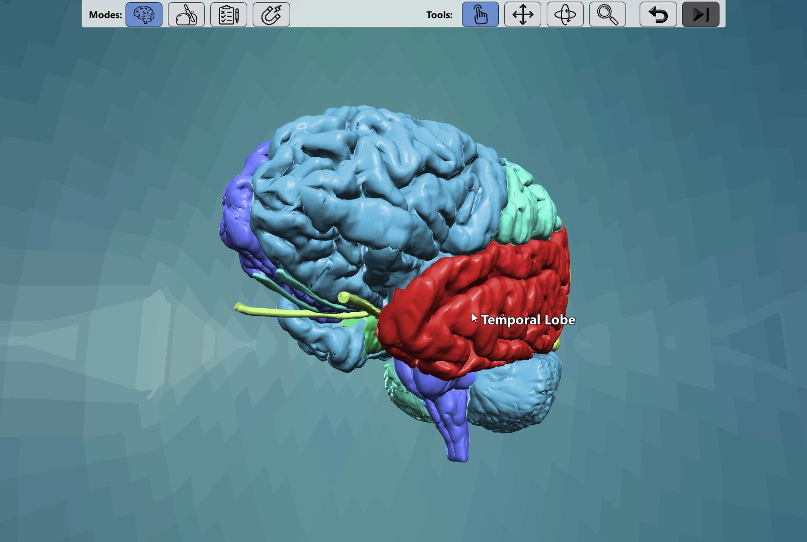

# VR Neuroanatomy
Understanding the anatomy of complex organs such as the human brain can be a challenge for students, so there is a definite advantage given to students who can experience the structures in a 3-dimensional that provides immediate feedback and the ability to maneuver around the brain itself. Since 2016, the Marquette Visualization Lab has been utilizing a dataset of 3 and 7 Tesla MRI scans from the Structural Informatics Group at the University of Washington to visualize the structures of the brain in their Cave, utilizing the Unity game engine and 10 stereoscopic 3D projectors. Most MRI scans are presented as a volumetric rendering, but this dataset is unique because it was fully labeled and parcellated allowing the lab users view the structures of the brain and dissect it themselves on a device of their choice.

COVID-19 presented a new set of educational limitations, especially for courses that require students to understand such rigorous and complex information. Neuroanatomy learning techniques began with a textbook and have evolved due to technology. One of the first for our project was the MARVL visualization studio which allowed students to view the brain but not interact with it. We then transferred the cave to the Oculus Quest and VR abilities allowing an indiviual to watch the brain be pulled apart in a 3D manner. However, both of those versions didn't include all of the components we wanted such as immediate feedback and interactivity. This led us to development of the WegGL version which allows students to study the anatomy of the brain from any location. Additionally, a Quiz mode was developed which enables students to not only dissect the brain and learn the anatomy, but test if they know the specific functions of each brain part. The programming behind this development was focused on transforming prior Oculus Quest abilities to those that would operate on a device using keyboard features. A huge benefit we’ve noticed with the WebGL version is that the hands-on, independent, and active experience has increased student motivation to learn and overall interest in the subject. 

**Live demo**: [neuro.nfshost.com/](http://neuro.nfshost.com/)

### Modes:
* **Explore Mode:** Dissect the 3D model Explore the in and outs of the brain without the pressure of an exam or quiz. 
* **Slice Mode:** Slice the brain and see what the inside of the brain looks like in detail. 
* **Quiz mode:** Test what you know about the functions of specific brain parts. 
* **DTI mode:** Look at the blood flow of the brain in complete detail. 

### Tools:
The program is designed for desktop web browsers and a three button mouse, but a toolbar at the top exposes all functionality to touch-screen devices as well. Shortcuts work regardless of the current mode/tool.
* **Identify:** (5) Click to highlight a part and reveal its name.
* **Move:** (6) Drag to reposition a part. Double click to restore its position. Shortcut: WASD.
* **Rotate:** (7) Circle around the brain with your mouse. Shortcut: Drag the right mouse button, or use the arrow keys
* **Zoom:** (8) Drag up or down to move the camera. Shortcut: Drag or scroll mouse wheel, or press Q/E
* **Restore:** (R) In move mode, double click to restore all parts to the original positions. In rotate or zoom mode, restore the camera position.
* **Skip:** (Space bar) Quiz mode only. Skip the current question, or submit the selection as an answer.

## Development Requirements:
* [Unity](https://unity.com/) version [2019.4.17](https://unity3d.com/unity/qa/lts-releases?version=2019.4)
* A license to [Dotween Pro](https://assetstore.unity.com/packages/tools/visual-scripting/dotween-pro-32416) is required to run this without errors. Perhaps Dotween free will work, but I haven't tested it.
* [Blender](https://www.blender.org/) version >2.8.

## Authors, Marquette University
* Chris Larkee
* Davina Lettau 
* SuJean Choi

## Citations: 
This program uses data created and edited by John Sundsten, Associate Professor Emeritus in the Department of Biological Structure at the University of Washington, over about a 15 year period ending about 2000. These files Copyright, Structural Informatics Group, University of Washington, 2002 under the GNU Lessor Public License. 

Sundsten, J. W. (1994). Digital anatomist: Interactive brain atlas. 
Nolte, J., & Sundsten, J. W. (2001). The human brain: an introduction to its functional anatomy. Mosby. 

## License
[GNU Lesser General Public License](LICENSE.md)
